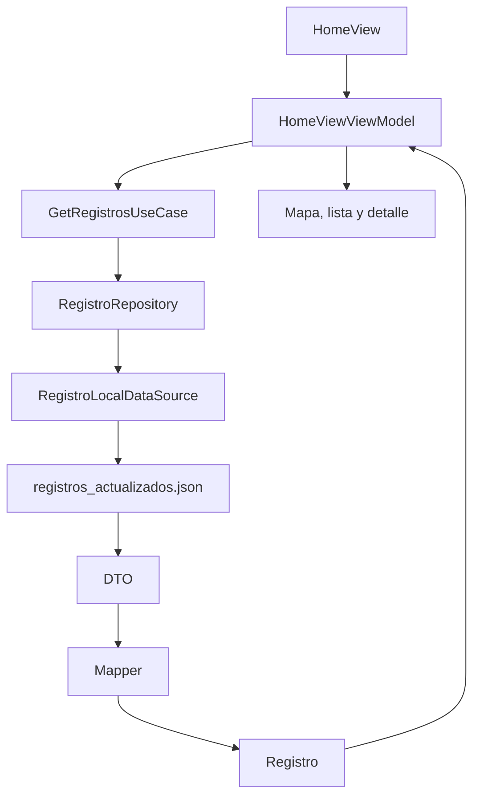

# Sonus Orbis

**Repositorio:** https://github.com/L-Villanueva/SonusOrbis

Aplicación nativa para iOS orientada a la consulta y exploración de **registros sonoros geolocalizados**. El sistema representa cada registro sobre un mapa interactivo, permite filtrarlo por categoría, consultar sus metadatos y reproducir los audios y vídeos asociados desde una interfaz integrada.

La aplicación está desarrollada con **SwiftUI**, combina componentes de **UIKit** para las funciones cartográficas avanzadas y utiliza **AVFoundation** y **AVKit** para la reproducción multimedia.

## Características principales

- Visualización de registros sonoros sobre un mapa interactivo.
- Anotaciones personalizadas según la categoría del sonido.
- Agrupamiento automático de marcadores cercanos mediante *clustering*.
- Filtrado de registros por tipo sonoro.
- Cambio entre mapa estándar y vista satélite.
- Consulta de registros desde una vista de mapa o una lista.
- Búsqueda de registros por nombre.
- Ficha de detalle con nombre, ubicación, fecha, hora, imagen, audio y vídeo.
- Reproducción persistente de audio durante la navegación.
- Control de reproducción, pausa, detención y posición temporal.
- Reproducción de vídeos verticales y horizontales a pantalla completa.
- Funcionamiento local sin necesidad de una API externa ni conexión a internet.

## Tecnologías utilizadas

| Tecnología | Uso dentro del proyecto |
|---|---|
| Swift | Lenguaje principal de desarrollo. |
| SwiftUI | Construcción declarativa de la interfaz, navegación y gestión de estado. |
| MapKit | Representación cartográfica, anotaciones y agrupamiento de puntos. |
| UIKit | Integración avanzada de `MKMapView` y controladores multimedia. |
| AVFoundation | Gestión y reproducción de audio mediante `AVPlayer`. |
| AVKit | Reproducción de vídeo mediante `AVPlayerViewController`. |
| JSON | Almacenamiento local de los registros y sus metadatos. |

## Arquitectura

El proyecto utiliza una arquitectura organizada en tres capas principales:

```text
Data
├── RegistroLocalDataSource
├── DTO
├── Mappers
└── Repository implementation

Domain
├── Registro
├── TipoRegistro
├── Repository protocol
└── GetRegistrosUseCase

Presentation
├── HomeView
├── HomeViewViewModel
├── Map
├── List
├── Detail
├── Gallery
├── Information
├── Contact
└── Audio player
```

### Data

Responsable del acceso y transformación de los datos:

- Localiza y lee el archivo `registros_actualizados.json` desde `Bundle.main`.
- Decodifica la información en objetos de transferencia de datos.
- Convierte los DTO en modelos de dominio.
- Entrega los registros al repositorio.

### Domain

Contiene las entidades y operaciones centrales del sistema:

- Define el modelo `Registro`.
- Define las categorías de registros sonoros.
- Declara las abstracciones del repositorio.
- Expone `GetRegistrosUseCase` para obtener la colección de registros.

### Presentation

Gestiona la interfaz y la interacción del usuario:

- Muestra el mapa, la lista, el detalle, la galería y las pantallas informativas.
- Coordina navegación, búsqueda, filtros y selección de registros.
- Integra `MKMapView` y `AVPlayer` con SwiftUI.
- Mantiene el estado compartido de reproducción.

## Flujo de datos



El flujo principal de carga es el siguiente:

1. `HomeView` crea el `HomeViewViewModel`.
2. El *view model* ejecuta `GetRegistrosUseCase`.
3. El caso de uso solicita la información al repositorio.
4. El repositorio delega la lectura en `RegistroLocalDataSource`.
5. El *datasource* lee y decodifica el JSON incluido en el bundle.
6. Los DTO se transforman en objetos `Registro`.
7. Los registros se publican y actualizan las vistas.

## Modelo de registro

Cada registro puede incluir los siguientes datos:

| Campo | Descripción |
|---|---|
| Nombre | Identificación visible del registro. |
| Fuente | Procedencia o referencia del contenido. |
| Audios | Uno o varios archivos sonoros asociados. |
| Coordenadas | Latitud y longitud del punto registrado. |
| Fecha y hora | Contexto temporal de la captura. |
| Imagen | Recurso visual asociado. |
| Vídeo | Recurso audiovisual asociado. |
| Tipo | Categoría utilizada para filtros e iconos. |

## Categorías sonoras

El sistema contempla las siguientes categorías:

- `motor`
- `antropico`
- `naturaleza`
- `atarraya`
- `playa`
- `aves`

Cada categoría utiliza un icono específico en el mapa para facilitar su identificación visual.

## Mapa y clustering

La pantalla principal utiliza `MKMapView`, integrado dentro de SwiftUI mediante `UIViewRepresentable`.

Esta implementación permite:

- Utilizar anotaciones totalmente personalizadas.
- Controlar los delegados de MapKit.
- Agrupar marcadores cercanos mediante *clustering*.
- Mostrar el número de registros incluidos en cada agrupación.
- Aplicar filtros por categoría.
- Alternar entre mapa estándar y satélite.

El componente encargado de esta integración es `ClusteredMapUIKitView`.

## Reproducción de audio

La reproducción se centraliza en `AudioPlayerManager`, un objeto compartido que utiliza `AVPlayer`.

El gestor mantiene:

- La pista seleccionada.
- El nombre del registro activo.
- El estado de reproducción o pausa.
- La duración total.
- La posición temporal actual.

Al registrarse como `EnvironmentObject`, la reproducción no depende del ciclo de vida de una única pantalla. El usuario puede iniciar un audio desde el detalle y continuar escuchándolo mientras navega por el mapa o por la lista.

Desde el reproductor inferior es posible:

- Reproducir y pausar.
- Detener la pista.
- Continuar la reproducción.
- Modificar la posición mediante un `Slider`.

## Reproducción de vídeo

Los vídeos se cargan desde los recursos de la aplicación. Cuando es necesario, se escriben temporalmente en una ubicación reproducible y se presentan mediante `AVPlayerViewController`.

La implementación contempla:

- Vídeos en orientación vertical y horizontal.
- Adaptación al formato del contenido.
- Reproducción a pantalla completa.

## Estructura de recursos

El proyecto incluye de forma local:

- `registros_actualizados.json`
- Iconos de categorías.
- Imágenes de los registros.
- Archivos de audio.
- Archivos de vídeo.

Los recursos deben añadirse al *target* correspondiente y aparecer en **Copy Bundle Resources** cuando proceda.

## Instalación y ejecución

1. Clona el repositorio:

```bash
git clone https://github.com/L-Villanueva/SonusOrbis.git
```

2. Abre el proyecto en Xcode:

```bash
open SonusOrbis.xcodeproj
```

3. Selecciona un simulador o dispositivo iOS compatible.

4. Comprueba que `registros_actualizados.json` y los recursos multimedia están incluidos en el *target*.

5. Ejecuta la aplicación desde Xcode con `Cmd + R`.

## Configuración del archivo JSON

El archivo `registros_actualizados.json` debe estar incluido en el bundle de la aplicación. Una estructura conceptual de registro sería:

```json
{
  "name": "Nombre del registro",
  "source": "Fuente del contenido",
  "audios": ["audio_01"],
  "location": {
    "latitude": 0.0,
    "longitude": 0.0
  },
  "date": "Fecha del registro",
  "time": "Hora del registro",
  "image": "imagen_01",
  "video": "video_01",
  "type": "naturaleza"
}
```

La estructura exacta debe coincidir con los DTO definidos en el proyecto.

## Funcionamiento sin conexión

Todos los registros y recursos multimedia se distribuyen dentro de la propia aplicación. Por este motivo, el sistema puede funcionar sin conexión a internet y sin depender de una API externa.

Esta decisión simplifica el despliegue y garantiza la disponibilidad del contenido. Como contrapartida, la actualización de registros requiere modificar los recursos del proyecto y distribuir una nueva versión de la aplicación.

## Posibles mejoras

- Sincronización de registros con una API remota.
- Descarga selectiva y almacenamiento en caché de recursos.
- Persistencia de favoritos.
- Búsqueda por proximidad geográfica.
- Accesibilidad ampliada.
- Gestión dinámica de categorías.
- Pruebas unitarias para DTO, mapeos y casos de uso.
- Pruebas de estado para el reproductor de audio.
- Persistencia de la última posición reproducida.

## Objetivo del proyecto

El objetivo es ofrecer una experiencia integrada para explorar paisajes sonoros mediante su relación con el territorio. La aplicación combina cartografía, metadatos y contenido multimedia en una solución mantenible, coherente y disponible sin conexión.
